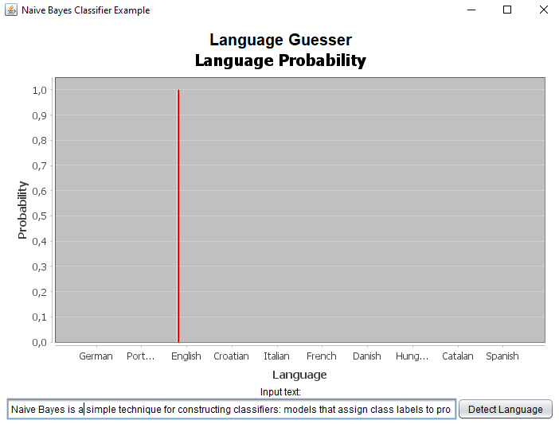
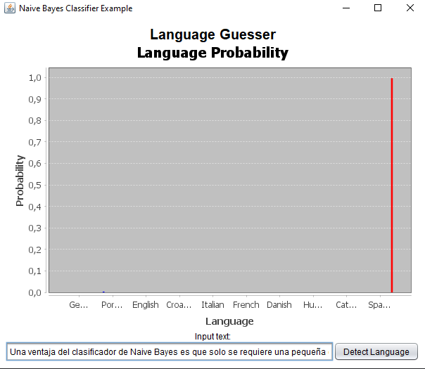
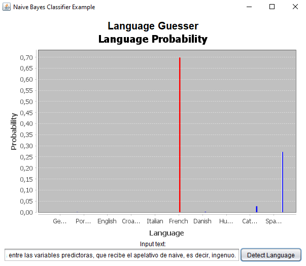

# Naive Bayes Classifier Example

This is a simple example with UI interface to show how Naive Bayes Classifier works. In this example is like a sentence classifier, it will classify a sentence into a language category. See the folder [data](./data/) for the training data and the possible categories.

> **Note:** The dataset provided is a small dataset, so the results may not be accurate. For more accurate results, you should use an extensive dictionary.

## Extra

This example uses JFreeChart to show the results in bar chart and Better Swing for the UI interface.

## Screenshots

